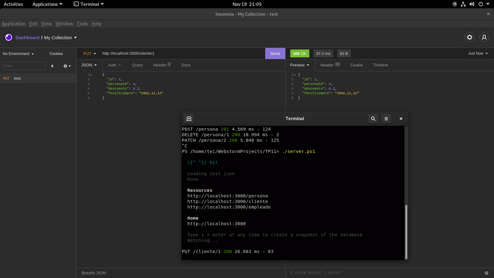

#TRABAJO PRACTICO NRO 11 (api)
instala nodejs y luego el paquete json-server
seguidamente crea un archivo llamado empresa.json con las
siguiente entidades (1 dato por cada uno)

```txt
PERSONA
id
apeynom
domicilio
telefono
fechanac


CLIENTE
id
personaId
descuento
fecultcompra


EMPLEADO
id
personaId
puesto
comisionporvta

```

y finalmente prueba con la extensión thunder client (o la aplicación postman) para cargar
las 3 entidad con 5 elementos cada una mediante el método post. Pruebe también los métodos

